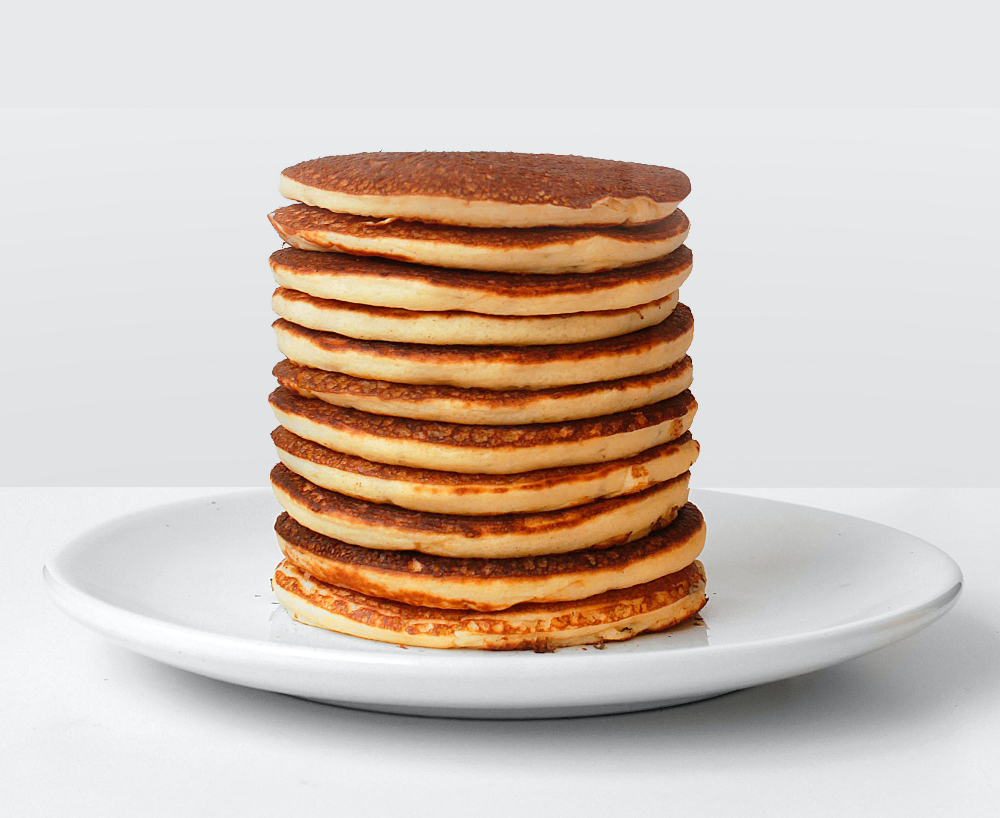
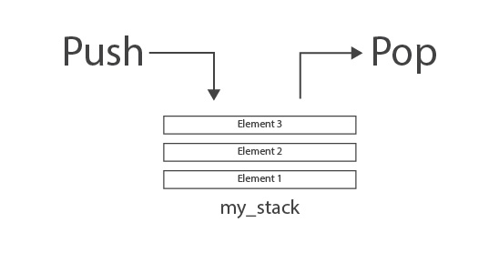

# Stacks


My professor used this analogy when teaching me about stacks: Think of a stack as a pile of pancakes. Every time you make one, you put it on top of the pile, and when you are going to eat one, you take one also from the top of the pile. The same applies for sto Stacks. Stacks organize and use the data using the **LIFO** strategy: **Last** in First out*.
When we add something to a stack, we add it at the end of the collection. We call this function **push**, and when we remove something from a stack, we remove the last element of the collection. We call this function **pop**. Since stacks add and remove from the end of a collection, they are perfect to keep a history of where you were.
<br>

 A real-world example of this is the undo functionality. When you undo to a previous stage, you go back one step. In other words you pop an element from the stack. 

<p align="center">

</p>

## Practice Problem
Let us give it a try to a very simple problem.
### Problem definition:
You're given an array of unsorted numbers. Your task is to reverse this array of numbers and store them in a new array using a stack.
```
[2, 3, 6, 1, 12, 45]
```
Expected output
```
[45, 12, 1, 6, 3, 2]
```
1. Initialize the array of numbers, and another to store the reversed array.
```python
# Array of numbers
numbers = [2, 3, 6, 1, 12, 45]

# Empty array to store the result
numbers_reversed = []
```
2. We are going to use an index loop to iterate through the list. 
```python
for i in range(len(numbers)):
```
3. In the body of the loop, we are going to use the `pop()` and `append()` methods to reversed our array. *Python method to **push** in an array is `append()`.*
```python
numbers_reversed.append(numbers.pop())
```
### Source code:
```python
# Array of numbers
numbers = [2, 3, 6, 1, 12, 45]

# Empty array to store the result
numbers_reversed = [] 

for i in range(len(numbers)):
	numbers_reversed.append(numbers.pop())

print(numbers_reversed)
```
You could also do this with fewer lines of code:
```python
numbers =  [2, 3, 6, 1, 12, 45]  

numbers_reversed = [number.pop() for i in range(len(numbers)]

print(numbers_reversed)
```
**Output:**
`[45, 12, 1, 6, 3, 2]`

## Your turn
Try solving the following problem using stacks.
### Problem definition:
A palindrom is word, phrase, or number that reads the same forward and backward. For example, the word radar is the same written backward. Write a program that prompts for a word, phrase, or number and checks if is a palindrom.<br>
Use the following as test cases:
1. Cat = ```False```
2. Rotator = ```True```
3. No lemon, no melon = ```True```
4. 12031 = ```False```
5. 23532 = ```True``` 
6. Go home now = ```False```

### Solution
Compare your program with the solution provided [Polindrome Solution](solutions/palindrome.py).


## Let's talk Big(O)
Stacks are very efficient. All of its primary functions have an efficiency of O(1) or constant time.

 Python syntax | Purpose | Performance| 
| :-: | :-: | :-: |
| `some_array.append()` | Adds an element to the back of the array |O(1)|
| `some_array.pop()` | Removes the last element in the array | O(1)|
| `len(some_array)` | Gets the size of the array | O(1) |
| `if len(some_array) == 0` | Check if the array is empty | O(1)


