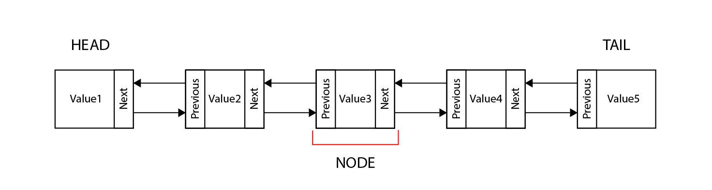

# Linked Lists
Linked lists are characterized for no continuos memory. Unlike dynamic arrays, where each element is right next to each other, a collection of data in a linked list can be stored randomly in memory. Therefore, there is no garantee that one element is next to another. But, how could we keep our elements together? In order to keep our collection together, every element (called a **node**) will have a **value** and a reference that points to the next **node**
## Head and tail
If we want traverse through our linked list, we will need to know where to begin and where to end. The first node in the linked list is refered as the **head** or the begining of the collection, and the last node is refered as the **tail**. 
Most linked lists use a bi-directional linking between nodes. This meas that each node will mantain a pointer to both the next and the previous element.
<p align="center">

</p>

## How to insert an element into a linked list
The process of inserting into a linked list will depend on where into the collection you want to add the new element.
### Inserting at the head.
Insresting a new element at the head is an easy 4 step process.
1. Create the new elemenet: ```new_node```
2. Set the **next** of the ```new_node``` to the head: ```new_node.next = self.head```
3. Set the ```new_node``` to be the **previous** of the head: ```self.head.prev = new_node```
4. Set ```new_node``` to be the new head: ```self.head = new_node```

### Inserting at the tail
Similiraly to inserting at the head, inserting at the tail is a 4 step process:
1. Create the new element:```new_node```
2. Set the **previous** of the ```new_node``` to the tail: ```new_node.prev = self.tail```
3. Set the ```new_node``` to be the **next** of the tail: ```self.tail.next = new_node```
4. Set the ```new_node``` to be the new tail: ```self.tail = new_node```

### Inserting into the middle
The process of inserting a new element into the middle is a bit different:
1. Create the new element: ```new_node```
2. Set the **previous** of the ```new_node``` to the current node: ```new_node.prev = current```
3. Set the **next** of the ```new_node``` to the **next** node after the current: ```new_node.next = current.next```
4. Set the ```new_node``` to be the **previous** of the node after the current: ```current.next.prev = new_node```
5. Set the ```new_node``` to be the **next** of the current node: ```current.next = new_node```

## How to remove an element from the linked list
### Removing the first element (head)
1. Set the **previous** of the second node to nothing: ```self.head.next.prev = None```
2. Set the head to be the second element : ```self.head = self.head.next```
### Removing the last element (tail)
1. Set the **next** of the seconf to last element to be nothing: ```self.tail.prev.next = None```
2. Set the tail to be the second to last element: ```self.tail = self.tail.prev```
### Removing an element from the middle
1. Set the **previous** of the node after the current to the node before the current: ```current.next.prev = current.prev```
2. Set the **next** of the node before the current to the node after the current: ```current.prev.next = current.next```


