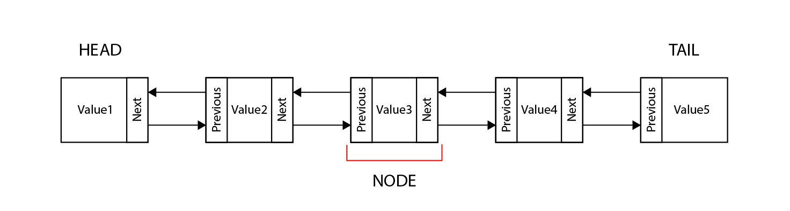

# Linked Lists
Linked lists are characterized for no continuos memory. Unlike dynamic arrays, where each element is right next to each other, a collection of data in a linked list can be stored randomly in memory. Therefore, there is no garantee that one element is next to another. But, how could we keep our elements together? In order to keep our collection together, every element (called a **node**) will have a **value** and a reference that points to the next **node**
## Head and tail
If we want traverse through our linked list, we will need to know where to begin and where to end. The first node in the linked list is refered as the **head** or the begining of the collection, and the last node is refered as the **tail**. 
Most linked lists use a bi-directional linking between nodes. This meas that each node will mantain a pointer to both the next and the previous element.
<p align="center">

</p>

## How to insert an element into a linked list
The process of inserting into a linked list will depend on where into the collection you want to add the new element.
### Inserting at the head.
Inserting a new element at the head is an easy 4 step process.
1. Create the new elemenet: ```new_node```
2. Set the **next** of the ```new_node``` to the head: ```new_node.next = self.head```
3. Set the ```new_node``` to be the **previous** of the head: ```self.head.prev = new_node```
4. Set ```new_node``` to be the new head: ```self.head = new_node```

### Inserting at the tail
Similiraly to inserting at the head, inserting at the tail is a 4 step process:
1. Create the new element:```new_node```
2. Set the **previous** of the ```new_node``` to the tail: ```new_node.prev = self.tail```
3. Set the ```new_node``` to be the **next** of the tail: ```self.tail.next = new_node```
4. Set the ```new_node``` to be the new tail: ```self.tail = new_node```

### Inserting into the middle
The process of inserting a new element into the middle is a bit different:

1. Create the new element: ```new_node```
2. Set the **previous** of the ```new_node``` to the current node: ```new_node.prev = current```
3. Set the **next** of the ```new_node``` to the **next** node after the current: ```new_node.next = current.next```
4. Set the ```new_node``` to be the **previous** of the node after the current: ```current.next.prev = new_node```
5. Set the ```new_node``` to be the **next** of the current node: ```current.next = new_node```


## How to remove an element from the linked list
### Removing the first element (head)
1. Set the **previous** of the second node to nothing: ```self.head.next.prev = None```
2. Set the head to be the second element : ```self.head = self.head.next```
### Removing the last element (tail)
1. Set the **next** of the seconf to last element to be nothing: ```self.tail.prev.next = None```
2. Set the tail to be the second to last element: ```self.tail = self.tail.prev```
### Removing an element from the middle
1. Set the **previous** of the node after the current to the node before the current: ```current.next.prev = current.prev```
2. Set the **next** of the node before the current to the node after the current: ```current.prev.next = current.next```

## How to implement a Linked List in python
If we want to create a linked list in python, we neeed to create 2 classes. The LinkedList class and the Node Class.
```python
class LinkedList:

    # Class to store the data of every element in the linked list
    class Node:
        def __init__(self, data):
            self.next = None
            self.prev = None
            self.data = data

    # Create an empty linked list 
    def __init__(self):
        self.head = None
        self.tail = None
```
Inside the LinkedList class we'll add all the methods to manipulate our LinkedList. ```insert_head()```, ```insert_tail()```, ```remove_head()```, ```remove_tail()```, etc. You would follow the steps above to implement these methods.
## Practice Problems
Let's practice practice creating the ```insert_head()```, and ```insert_tail()``` methods for our linked list 
### Problem definition:
Create the method ```insert_head()```. Implement the method to handle the case if the list is empty or it's not.
1. Create the ```insert_head()``` method:
```python
    def insert_head(self, value):
```
2. Create the new node:
```python
        new_node = LinkedList.Node(value)
```
3. If the list is empty set the head and the tail to the new_node:
```python
        if self.head is None:
            self.head = new_node
            self.tail = new_node
```
4. If the list is not empty, we'll change the head to be the new node:
```python
        else:
            new_node.next = self.head
            self.head.prev = new_node
            self.head = new_node
```
### Problem definition
Create the method ```insert_tail()```. Implement the method to handle the case if the list is empty or it's not.
1. Create the ```insert_tail()``` method:
```python
    def insert_tail(self, value):
```
2. Create the new node:
```python
        new_node = LinkedList.Node(value)
```
3. If the list is empty set the head and the tail to the new_node:
```python
        if self.tail is None:
            self.head = new_node
            self.tail = new_node
```
4. If the list is not empty, we'll change the head to be the new node:
```python
        else:
            new_node.prev = self.tail
            self.tail.next = new_node
            self.tail = new_node
```
## How to implement a linked list in python using deque()
Python has a way to implement a Linked list using the deque method from collections.
```python
# Import the deque method
from collections import deque

# Create the linked list with 3 elements
linked_list = deque([6, 2, 3, 1, 20])

# Insert something at the head
linked_list.appendleft(0)

# Insert something at the end
linked_list.append(9)

# Insert something at the middle .insert(i, value)
linked_list.insert(1, 8)

# Removing the head
linked_list.popleft()

# Removing the tail
linked_list.pop()

# Remove an element [i]
del linkedlist[2]
```
## Your turn
Try solving the following problem using linked lists.
### Problem definition:
In the practice problems, we implemented the `insert_head()` and `insert_tail()`. Now is your turn to implement the following methods in the Node class:<br>
```python
def remove_head()
def remove_tail()
def remove_node()
def insert_next()
```
## Important:
You will need to add these two methods in the LinkedList class for your program to work
```python
# Iterate foward through the Linked List
def __iter__(self):
    curr = self.head  # Start at the begining since this is a forward iteration.
    while curr is not None:
        yield curr.data  # Provide (yield) each item to the user
        curr = curr.next # Go forward in the linked list

# Return a string representation of the linked list.
def __str__(self):
    output = "linkedlist["
    first = True
    for value in self:
        if first:
            first = False
        else:
            output += ", "
        output += str(value)
    output += "]"
    return output
```
Use the following as your test cases.
```python
linked_list = LinkedList()
linked_list.insert_head(3)
linked_list.insert_head(2)
linked_list.insert_head(7)
linked_list.insert_head(9)
linked_list.insert_head(10)
linked_list.insert_tail(20)
print(linked_list) #linkedlist[10, 9, 7, 2, 3, 20]
linked_list.remove_head()
print(linked_list) # linkedlist[9, 7, 2, 3, 20]
linked_list.remove_tail()
linked_list.remove_node(7)
print(linked_list) # linkedlist[9, 2, 3]
linked_list.insert_next(2, 11)
print(linked_list) # linkedlist[9, 2, 11, 3]
```
### Solution
Compare your program with the solution provided [Linked List Solution](solutions/linked_list.py).

## Let's talk Big(O)
Stacks are very efficient. All of its primary functions have an efficiency of O(1) or constant time.

 Python syntax | Purpose | Performance| 
| :-: | :-: | :-: |
| `linked_list.appendleft(value)` | Adds a value at the head |O(1)|
| `linked_list.append()` | Adds a value at the tail | O(1)|
| `linked_list.insert(i, value)` | Insert a value at the index | O(n) |
| `linked_list.popleft()` | Removes the first element | O(1)
| `linked_list.pop()` | Removes the last element | O(1)
| `linked_list.remove()` | Removes an element at index | O(n)
| `len(linked_list)` | Gets the size of the linked list | O(1)
| `if len(linked_list) == 0` | Checks if a linked list is empty | O(1)


