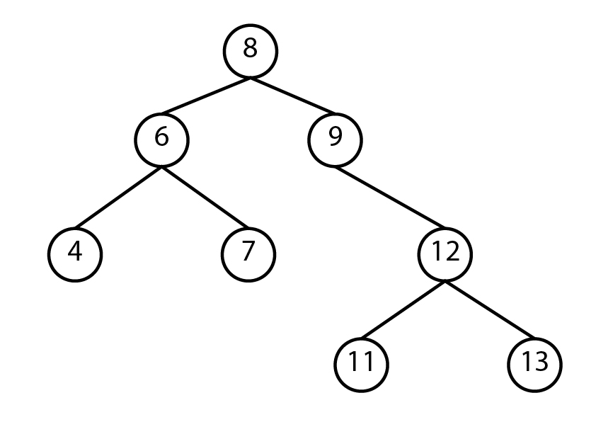

# Trees

A tree is a data structur similar to a linked list in that nodes are connected by pointers; however, unlike linked lists, trees are nonlinear, meaning that a tree can connect to multiple nodes. 
 
In this tutorial, we will talk about three different types of trees: binary trees, binary search trees, and balanced binary search trees.

## Binary Trees
A binary tree is a tree that points to no more than two other nodes. The top node is refered as the root. A node that has connceted other nodes is called a parent node. Each node connected to a parent node is refered as the left child and the right child. Nodes that connect to no other nodes are called leaf nodes.

## Binary search tree
A binary search tree is a tree that follows some rules to store data in the tree:
* The left child is always less than the parent node.
* The right child is always more than the parent node
 

By following these rules, we always know where to put additional items. One of the advantages of a binary search tree is that we can locate an element without the need of visiting every item in the tree.
 
Let's assume that we want to check if the number 18 is in our binary tree. We'll start in the root which is 20. Since 18 is less than 20, we will go to next node on the left. Now, 16 which is the parent node is less than 18, so we'll go to the right child. We'll do the same en compare the value in the node which is 17 and is less than 18, so we'll go to the right node. The value in the node is 18 which is the values that we were looking for.  
There are 9 elements in our binary tree, but we did not need to visit every element to find the value. Instead, we only needed 4 iterations to find it.