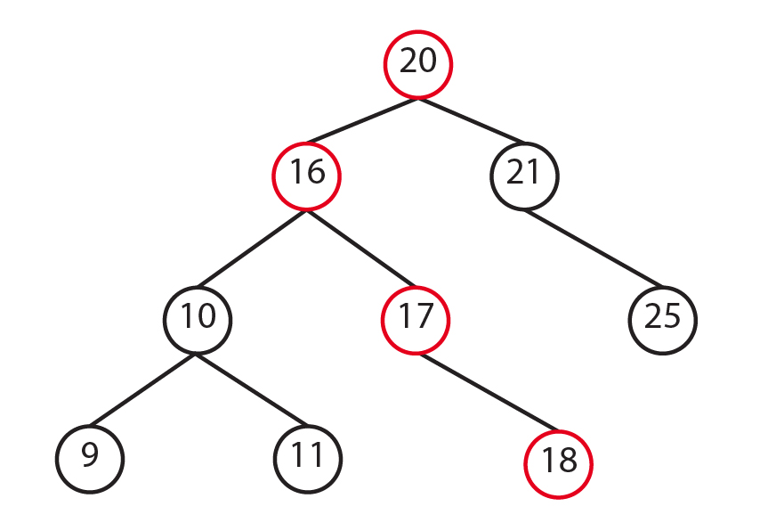

# Trees

A tree is a data structure similar to a linked list in that nodes are connected by pointers; however, unlike linked lists, trees are nonlinear, meaning that a tree can connect to multiple nodes. 
</br>
In this tutorial, we will talk about three different types of trees: binary trees, binary search trees, and balanced binary search trees.
<p align="center">

</p>

## Binary trees
A binary tree is a tree that points to no more than two other nodes. The top node is refered as the root. A node that has connceted other nodes is called a parent node. Each node connected to a parent node is refered as the left child and the right child. Nodes that connect to no other nodes are called leaf nodes.
<p align="center">

</p>

## Binary search tree
A binary search tree (BST) is a tree that follows some rules to store data in the tree:
* The left child is always less than the parent node.
* The right child is always more than the parent node
<br>

By following these rules, we always know where to put additional items. One of the advantages of a binary search tree is that we can locate an element without the need of visiting every item in the tree. Let's assume that we want to check if the number 18 is in our binary tree. We'll start in the root which is 20. Since 18 is less than 20, we will go to next node on the left. Now, 16 which is the parent node is less than 18, so we'll go to the right child. We'll do the same en compare the value in the node which is 17 and is less than 18, so we'll go to the right node. The value in the node is 18 which is the values that we were looking for. There are 9 elements in our binary tree, but we did not need to visit every element to find the value. Instead, we only needed 4 iterations to find it.
<p align="center">

</p>
If we were using a dynamic array, we would need to visit every element in the array in the worst escenario to check if an element exists in the array that would be a Big O of O(n). With the BST, we accomlish this with a Big O of O(log n). However, to have this efficency we need our BST to be balanced. Take a look to the image below. It looks more to a linked list. It's not efficient.
<p align="center">

</p>

## Balanced binary search tree
A balanced binary search tree is a tree that the difference of height between subtrees is not much different. The height of the tree can be found by calculating the maximum number of nodes between the root and leaves.

## How to implement a BST in Python
We use recursion for the basic operations in the BST. When ussing recursion, we need to first make the problem smaller, and second declare our base cases. There are some packages that you can install to implement binary trees. In this tutorial, we're going to create our own classes to implement a binary tree.
```python
class BST:

    class Node:
        # Class to store the data, left pointer, and right pointer
        def __init__(self, data):
            self.data = data
            self.left = None
            self.right = None

    # The BST class will hold the pointer to the root node
    def __init__(self):
        self.root = None
```
### How to insert a new node into a BST
1. Create the `insert()` function in the BST class with the base case being that the node is empty
2. If the root node is not empty, we will call recursive function `_insert()`, which we'll create later, to find a place for the new node.
```python
def insert(self, data):

    # Special case where the tree is empty
    if self.root is None:
        self.root = BST.Node(data)
    
    # Call the _insert function to find a place for the new node
    else:
        self._insert(data, self.root)
```
3. Now, lets create the `_insert()` function which it's going to be recursivly. This function will look for a place for our new node. Following the rules of a BST, is the data is less than the current node, and the current node is not empty, we'll put the data in that place. If it's not empty, we'll keep calling the `_insert()` function.
4. We'll do the same thinkg but to the right when the data is greater than the current node.
```python
def _insert(self, data, node):

    # The data is less than current node, look for a place on the left
    if data <= node.data:
        if node.left is None:
            node.left = BST.Node(data)
        else:
            self._insert(data, node.left)
    
    # The data is greater than the current node, look for a place on the right
    elif data >= node.data:
        if node.right is None:
            node.right = BST.Node(data)
        else:
            self._insert(data, node.right)
```
### How to traverse a BST
1. We'll create the `__iter__` function. This function is part of the python framework. It lets us get next element in a collection. In this case, it'll allow us to get the next value in our BST. It will let us use the `value in tree` syntax.
```python
def __iter__(self):

    # Will provide the next value.
    yield from self._traverse_forward()
```
2. Now, lets create the `_traverse_forward()` function. This function will visit all the elements on the left and all the elements on the right.
```python
def _traverse_forward(self, node):
    if node is not None:
        yield from self._traverse_forward(node.left)
        yield node.data
        yield from self._traverse_forward(node.right)
```
## Your turn
Create a function to traverse backward our tree
### Problem definition:
In this tutorial, we learned how to create the `_traverse_forward` function. Try to create a function that will let you traverse backward our tree. Hint: The syntax is very similar, you only need to change a few things in the `_traverse_forward`.
<br>
## Important
Use this function to implement your `_traverse_backward` function:
```python
# This function will let you traverse backward the tree starting at the root
def __reversed__(self):

    yield from self._traverse_backward(self.root)
```
Use the following to test your tree
```python
tree = BST()
tree.insert(9)
tree.insert(5)
tree.insert(1)
tree.insert(8)
tree.insert(10)

for i in tree:
    print(i)

print(2 in tree) # False
print(10 in tree) # True
print(3 in tree) # False
print(9 in tree) # True
```
### Solution
Compare your program with the solution provided [Trees Solution](solutions/trees.py).
## Let's talk Big(O)

 Python syntax | Purpose | Performance| 
| :-: | :-: | :-: |
| `insert(value)` | Adds a value in the tree |O(log n)|
| `remove(value)` | Removes a value from the tree | O(log n)|
| `contains(value)` | Checks if a value exists in the tree | O(log n) |
| `traverse_forward` | Visits all elements from smallest to largest | O(n)
| `traverse_reverse` | Visits all elements from largest to smallest | O(n)
| `height(root)` | Determine the size of a tree | O(n)
| `size()` | Returns the size of the tree | O(1)
| `empty()` | Check if the tree is empty | O(1)
